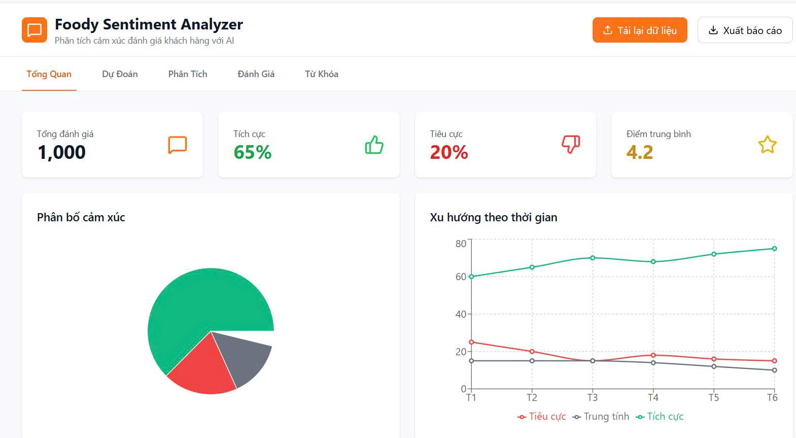
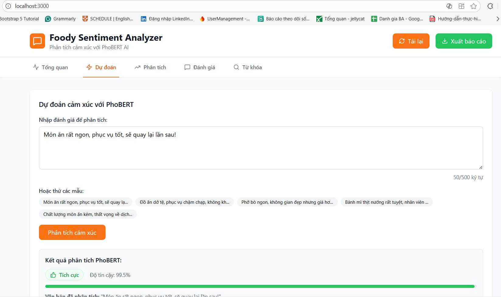

<h1 align="center">
🍽️ Foody Sentiment Analyzer 
</h1>
<div align="center">
  
</div>

## 📋 Giới thiệu

Dự án phân tích cảm xúc khách hàng từ các đánh giá trên nền tảng Foody sử dụng kỹ thuật Xử lý Ngôn ngữ Tự nhiên (NLP). Hệ thống có khả năng tự động phân loại các đánh giá thành các nhóm cảm xúc (tích cực, tiêu cực, trung lập), giúp nhà hàng và doanh nghiệp hiểu rõ hơn về trải nghiệm khách hàng.

## ✨ Tính năng chính

- 🔍 **Phân tích cảm xúc real-time** từ văn bản tiếng Việt với độ chính xác 90.5%
- 📊 **Dashboard trực quan** với biểu đồ tròn và line chart theo thời gian
- 🤖 **PhoBERT AI Model** - mô hình NLP tiên tiến cho tiếng Việt
- 💬 **Gợi ý mẫu review** để test nhanh
- 📈 **Thống kê chi tiết**: tổng đánh giá, tỷ lệ tích cực/tiêu cực, điểm TB
- 🎯 **Hiển thị độ tin cậy** của từng dự đoán (confidence score)
- 📑 **Xuất báo cáo** và tải lại dữ liệu
- 🎨 **Giao diện hiện đại** với nhiều tab điều hướng

## 🛠️ Công nghệ sử dụng

- **Ngôn ngữ lập trình**: Python 3.x
- **Framework Web**: Flask/Django (dựa trên App.js)
- **Machine Learning**: Scikit-learn, TensorFlow/PyTorch
- **NLP**: NLTK, spaCy, hoặc PhoBERT
- **Frontend**: HTML5, CSS3, JavaScript
- **Visualization**: Matplotlib, Seaborn

## 📁 Cấu trúc thư mục

```
foody-sentiment-analyzer/
│
├── data_train/              # Dữ liệu huấn luyện
├── data_test/               # Dữ liệu kiểm thử
│
├── src/                     # Mã nguồn chính
│   ├── App.css             # Style cho ứng dụng
│   ├── App.js              # Component chính
│   ├── App.test.js         # Unit tests
│   ├── index.css           # Global styles
│   ├── index.js            # Entry point
│   ├── logo.svg            # Logo dự án
│   ├── reportWebVitals.js  # Performance monitoring
│   └── setupTests.js       # Cấu hình testing
│
├── public/                  # Static files
├── node_modules/           # Dependencies (npm)
│
├── app.py                  # Backend server chính
├── evaluate_model.py       # Script đánh giá mô hình
├── main.py                 # Entry point chính
├── predict.py              # Script dự đoán
│
├── phobert_foody_best_model.pth  # Model đã train
│
├── .gitignore              # Git ignore rules
├── package.json            # NPM dependencies
├── package-lock.json       # NPM lock file
├── requirements.txt        # Python dependencies
└── README.md               # Tài liệu dự án
```

## 🚀 Cài đặt và Sử dụng

### Yêu cầu hệ thống

- **Python**: 3.8 trở lên
- **Node.js**: 14.x trở lên
- **npm** hoặc **yarn**
- **GPU**: Khuyến nghị (CUDA-compatible) cho training và inference nhanh hơn
- **RAM**: Tối thiểu 8GB, khuyến nghị 16GB
- **Dung lượng ổ cứng**: Ít nhất 5GB cho model và dependencies

### Bước 1: Clone Repository

```bash
git clone https://github.com/Thuhuyen8324/Phan-tich-cam-xuc-khach-hang-tu-danh-gia-tren-Foody-bang-xu-ly-ngon-ngu-tu-nhien.git
cd foody-sentiment-analyzer
```

### Bước 2: Cài đặt Python Dependencies

1. Tạo môi trường ảo (khuyến nghị):
```bash
python -m venv venv
```

2. Kích hoạt môi trường ảo:
```bash
# Linux/Mac
source venv/bin/activate

# Windows
venv\Scripts\activate
```

3. Cài đặt các thư viện cần thiết:
```bash
pip install -r requirements.txt
```

**Lưu ý**: Nếu sử dụng GPU, cài đặt PyTorch với CUDA:
```bash
# CUDA 11.8
pip install torch torchvision torchaudio --index-url https://download.pytorch.org/whl/cu118

# CUDA 12.1
pip install torch torchvision torchaudio --index-url https://download.pytorch.org/whl/cu121
```

4. Cài đặt PhoBERT tokenizer:
```bash
pip install transformers
pip install py-vncorenlp
```

### Bước 3: Tải Pre-trained Model

Model PhoBERT đã được huấn luyện sẵn trong file `phobert_foody_best_model.pth`. Đảm bảo file này tồn tại trong thư mục gốc của dự án.

**Cấu hình model:**
- Max Length: 128 tokens
- Base Model: PhoBERT-base
- Fine-tuned trên 30,000 reviews từ Foody

### Bước 4: Chuẩn bị Dữ liệu

Dữ liệu được tổ chức trong 2 thư mục:

```
data_train/
├── pos/    # 15,000 reviews tích cực
└── neg/    # 15,000 reviews tiêu cực

data_test/
├── pos/    # 5,000 reviews tích cực
└── neg/    # 5,000 reviews tiêu cực
```

### Bước 5: Cài đặt Frontend (Tùy chọn)

1. Cài đặt Node.js dependencies:
```bash
npm install
```

2. Chạy development server:
```bash
npm start
```

Frontend sẽ chạy tại: `http://localhost:3000`

### Bước 6: Chạy Backend Server

Khởi động Flask/Django server:
```bash
python app.py
```

Backend API sẽ chạy tại: `http://localhost:5000` (hoặc port được cấu hình)

### Bước 7: Kiểm tra Cài đặt

Chạy script đánh giá để kiểm tra model hoạt động đúng:
```bash
python evaluate_model.py
```

Kết quả mong đợi:
```
Model loaded from phobert_foody_best_model.pth. Max Length: 128
Đang load test data...
Loading pos: 100%|████████████████████| 5000/5000
Loading neg: 100%|████████████████████| 5000/5000
[Dữ liệu] Test: 10000 samples
Test Accuracy: ~90.53%
```

## 📊 Sử dụng Model

### Huấn luyện mô hình

```bash
python main.py --mode train --data data_train/
```

### Đánh giá mô hình

```bash
python evaluate_model.py --model phobert_foody_best_model.pth --data data_test/
```

### Dự đoán

```bash
python predict.py --text "Món ăn rất ngon, phục vụ tận tình!"
```

Hoặc sử dụng Python API:

```python
from predict import predict_sentiment

text = "Đồ ăn tệ, phục vụ lâu"
result = predict_sentiment(text)
print(f"Cảm xúc: {result['sentiment']}")
print(f"Độ tin cậy: {result['confidence']:.2%}")
```

## 📈 Kết quả Đánh giá Model

### Hiệu suất trên Test Set (10,000 samples)

**Độ chính xác tổng thể:** 90.53%

### Chi tiết theo từng lớp:

| Lớp | Precision | Recall | F1-Score | Support |
|------|-----------|--------|----------|---------|
| **Tiêu cực (Negative)** | 92.25% | 88.50% | 90.33% | 5,000 |
| **Tích cực (Positive)** | 88.95% | 92.56% | 90.72% | 5,000 |

### Phân tích:

- **Model cân bằng tốt** giữa Precision và Recall cho cả 2 lớp
- **F1-Score cao** (~90%) cho thấy model ổn định
- **Nhận diện Positive tốt hơn** (Recall: 92.56%) - ít bỏ sót đánh giá tích cực
- **Phân loại Negative chính xác hơn** (Precision: 92.25%) - ít dương tính giả

### Thông tin Dataset:

- **Training Set**: 30,000 samples (15,000 pos + 15,000 neg)
- **Test Set**: 10,000 samples (5,000 pos + 5,000 neg)
- **Max Token Length**: 128
- **Model Base**: PhoBERT-base (fine-tuned)

## 🎯 Roadmap

- [ ] Hỗ trợ phân tích đa ngôn ngữ
- [ ] Tích hợp API Foody
- [ ] Phân tích aspect-based sentiment
- [ ] Mobile app
- [ ] Real-time analysis
- [ ] Sentiment trend visualization
📸 Kết quả hiển thị
<div align="center">
  <p><strong>Ảnh cam hỏng được cảnh báo:</strong></p>
  
  
  <p><strong>Ảnh cam tươi trên web:</strong></p>
  
</div>

## 📝 License

Dự án này được phân phối dưới giấy phép MIT. Xem file `LICENSE` để biết thêm chi tiết.

## 👥 Tác giả

- **Initial work** - (https://github.com/Thuhuyen8324)

## 🙏 Lời cảm ơn

- Foody.vn vì cung cấp nền tảng đánh giá
- PhoBERT team cho pretrained model
- Cộng đồng NLP Việt Nam

## 📧 Liên hệ

- Email: nguyenthuhuyen8324@gmail.com
- Facebook: [Your Page](https://facebook.com/thuhuyen8324)
- LinkedIn: [Your Profile](www.linkedin.com/in/huyền)

---

⭐️ Nếu dự án hữu ích, hãy cho một star nhé!
